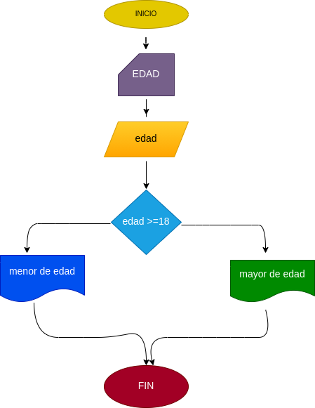

# EJERCICIO 1 ESTRUCTURAS CONDICIONALES

## Programa para verificar si usted esmayor de edad

## ANALISIS

### Definicion de variables 

edad: edad de persona
si la persona tiene 18 o mas aos es considerada mayor de edad 

## DISEÑO

